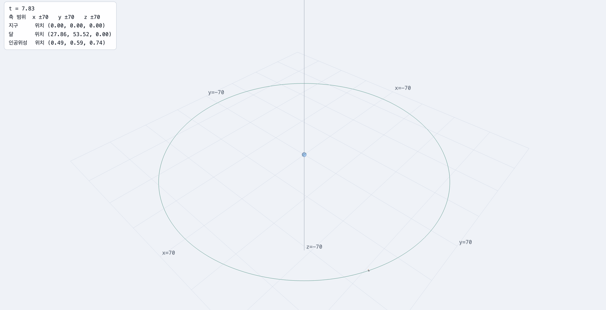
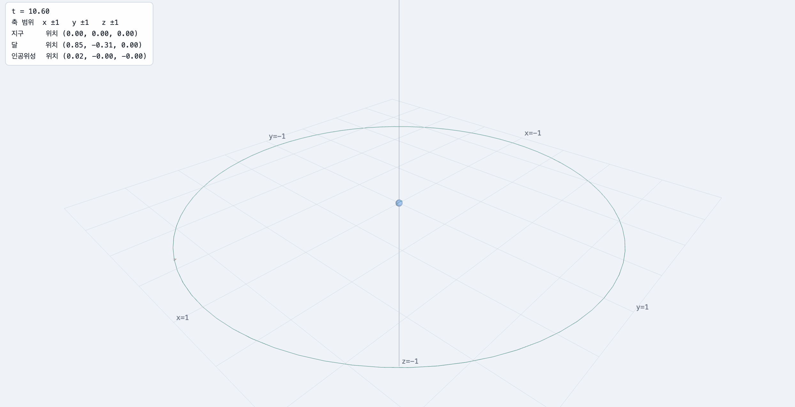
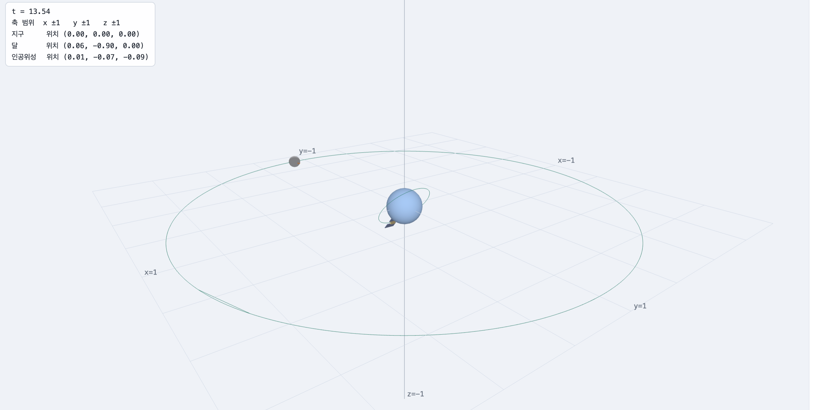

# Week 2 — 변환과 행렬

## Task 1 — 실제 물리값을 이용한 지구, 달, ISS 배치

### 1. 단위와 실제 수치 (과제1)

이번 Task에서는 지구의 반지름을 1로 두고, 다른 거리와 크기를 지구 반지름에 대한 비율로 나타냈다.

- 지구 반지름: 1
- 지구–달 평균 거리: 약 384,400 km
- 달의 반지름: 지구 반지름의 약 0.273배
- ISS 고도: 약 420 km
- ISS 궤도 경사각: 약 51.63°
- ISS의 크기 비율: 약 0.0000171

지구 반지름을 약 6,371 km로 두었기 때문에 지구와 달 사이의 거리는

384,400 / 6,371 ≈ 60.34

가 되어 달의 이동 거리를 60.34로 설정하였다.

ISS는 지구 표면 위 약 420 km 고도에서 공전하므로 지구 중심에서 ISS까지의 거리는

(6,371 + 420) / 6,371 ≈ 1.066

이 되어 ISS의 이동 거리를 1.066으로 설정하였다.

달의 반지름은 지구 반지름의 약 0.273배이므로 크기(균등)를 0.273으로 설정하였다.

ISS는 실제 크기가 지구에 비해 매우 작기 때문에 크기(균등)를 0.0000171로 설정하였다.

ISS의 실제 궤도 경사각을 반영하기 위해 Rx(51.63)을 사용하였다.

출처:

- NASA Moon Facts: https://science.nasa.gov/moon/facts/
- ISS (NORAD 25544): https://satellitemap.space/sat/25544


### 2. 축 범위

x, y, z축의 범위를 모두 ±70으로 설정하였다.

지구를 기준으로 달의 평균 거리가 약 60.34이므로 달의 전체 궤도가 화면 안에 들어오면서도 약간의 여유가 있도록 70으로 설정하였다.

x, y, z축을 모두 같은 값으로 설정하여 공간의 비율이 축마다 다르게 보이지 않도록 하였다.


### 3. 변환 입력값

```json
{
  "range": {
    "x": "70",
    "y": "70",
    "z": "70"
  },
  "objects": [
    {
      "id": "earth",
      "name": "지구",
      "color": [
        0.35,
        0.6,
        0.95
      ],
      "steps": [
        {
          "type": "Su",
          "args": [
            "1"
          ]
        }
      ]
    },
    {
      "id": "moon",
      "name": "달",
      "color": [
        0.78,
        0.78,
        0.82
      ],
      "steps": [
        {
          "type": "Rz",
          "args": [
            "t*100"
          ]
        },
        {
          "type": "T",
          "args": [
            "60.34",
            "0",
            "0"
          ]
        },
        {
          "type": "Su",
          "args": [
            "0.273"
          ]
        },
        {
          "type": "Rz",
          "args": [
            "180"
          ]
        }
      ]
    },
    {
      "id": "sat",
      "name": "인공위성",
      "color": [
        0.95,
        0.72,
        0.35
      ],
      "steps": [
        {
          "type": "Rx",
          "args": [
            "51.63"
          ]
        },
        {
          "type": "Rz",
          "args": [
            "t*100"
          ]
        },
        {
          "type": "T",
          "args": [
            "1.066",
            "0",
            "0"
          ]
        },
        {
          "type": "Su",
          "args": [
            "0.0000171"
          ]
        },
        {
          "type": "Rz",
          "args": [
            "180"
          ]
        }
      ]
    }
  ]
}
```

### 4. 각 변환을 이렇게 설정한 이유

#### 지구

`Su(1)`

지구를 이 장면의 크기와 거리의 기준으로 사용하기 때문에 지구의 반지름을 1로 설정하였다.

#### 달

`Rz(t*100) → T(60.34, 0, 0) → Su(0.273) → Rz(180)`

`Rz(t*100)`은 달이 지구를 중심으로 계속 공전하도록 하기 위한 회전이다. 이번 실습에서는 공전 움직임을 눈으로 쉽게 확인할 수 있도록 시간 t에 100을 곱하였다.

`T(60.34, 0, 0)`은 실제 지구–달 평균 거리를 지구 반지름을 1로 한 단위로 변환한 값이다.

`Su(0.273)`은 실제 지구와 달의 크기 비율을 표현하기 위한 값이다.

마지막 `Rz(180)`은 달의 로컬 +X 방향 화살표가 지구를 향하도록 방향을 반대로 돌리기 위해 사용하였다.

#### ISS

`Rx(51.63) → Rz(t*100) → T(1.066, 0, 0) → Su(0.0000171) → Rz(180)`

`Rx(51.63)`은 ISS의 실제 궤도 경사각 약 51.63°를 표현하기 위해 사용하였다.

`Rz(t*100)`은 ISS가 지구 주위를 공전하도록 만든다. 달과 마찬가지로 이번 실습에서는 움직임을 쉽게 확인하기 위해 t에 100을 곱하였다.

`T(1.066, 0, 0)`은 ISS의 고도를 고려하여 지구 중심에서 ISS까지의 거리를 지구 반지름 기준으로 표현한 값이다.

`Su(0.0000171)`은 ISS가 실제 지구에 비해 매우 작다는 크기 비율을 표현하기 위한 값이다.

마지막 `Rz(180)`은 ISS의 로컬 +X 방향 화살표가 항상 지구 방향을 향하도록 하기 위해 사용하였다.


### 5. 공유 링크

https://cg.catholic.ac.kr/~mgchoi/CG/demos/d02-transform-lab.html?d=eyJyYW5nZSI6eyJ4IjoiNzAiLCJ5IjoiNzAiLCJ6IjoiNzAifSwib2JqZWN0cyI6W3siaWQiOiJlYXJ0aCIsIm5hbWUiOiLsp4DqtawiLCJjb2xvciI6WzAuMzUsMC42LDAuOTVdLCJzdGVwcyI6W3sidHlwZSI6IlN1IiwiYXJncyI6WyIxIl19XX0seyJpZCI6Im1vb24iLCJuYW1lIjoi64usIiwiY29sb3IiOlswLjc4LDAuNzgsMC44Ml0sInN0ZXBzIjpbeyJ0eXBlIjoiUnoiLCJhcmdzIjpbInQqMTAwIl19LHsidHlwZSI6IlQiLCJhcmdzIjpbIjYwLjM0IiwiMCIsIjAiXX0seyJ0eXBlIjoiU3UiLCJhcmdzIjpbIjAuMjczIl19LHsidHlwZSI6IlJ6IiwiYXJncyI6WyIxODAiXX1dfSx7ImlkIjoic2F0IiwibmFtZSI6IuyduOqzteychOyEsSIsImNvbG9yIjpbMC45NSwwLjcyLDAuMzVdLCJzdGVwcyI6W3sidHlwZSI6IlJ4IiwiYXJncyI6WyI1MS42MyJdfSx7InR5cGUiOiJSeiIsImFyZ3MiOlsidCoxMDAiXX0seyJ0eXBlIjoiVCIsImFyZ3MiOlsiMS4wNjYiLCIwIiwiMCJdfSx7InR5cGUiOiJTdSIsImFyZ3MiOlsiMC4wMDAwMTcxIl19LHsidHlwZSI6IlJ6IiwiYXJncyI6WyIxODAiXX1dfV19


### 6. 결과 화면




### 7. 실행 코드

[Task 1 실행하기](https://pru1ts.github.io/cg-2026-solar/week2/task1.html)


---

## Task 2 — 고정된 화면 안에 전체 장면 담기 (과제2)

### 1. 배율 s 설정

Task 2에서는 x, y, z축의 범위를 모두 ±1로 고정하고, Task 1에서 만든 지구, 달, ISS의 실제 비율을 유지한 채 전체 장면이 화면 안에 들어오도록 공통 배율을 적용하였다.

가장 멀리 있는 물체는 달이며, 지구 중심에서 달 중심까지의 거리는 지구 반지름을 1로 했을 때 60.34이다. 달의 반지름은 지구 반지름의 0.273배이므로 달의 바깥쪽 가장자리까지의 거리는

60.34 + 0.273 = 60.613

정도이다.

따라서 화면 범위 ±1 안에 전체 장면이 들어오게 하기 위한 배율은 대략

s = 1 / 60.613 ≈ 0.0165

가 된다.

가장자리가 화면에 너무 가깝게 붙거나 잘리는 것을 방지하기 위해 약간의 여유를 두어 최종적으로 공통 배율을

s = 0.015

로 설정하였다.


### 2. 배율 행렬을 사슬의 맨 앞에 넣은 이유

이 실습에서는 행렬을 M1 · M2 · M3 · ... 순서로 곱하지만, 정점에는 오른쪽에 있는 변환부터 적용된다.

따라서 `Su(0.015)`를 변환 사슬의 맨 앞에 놓으면 각 물체 자체의 크기뿐만 아니라 이동에 의해 결정된 위치까지 최종적으로 0.015배가 된다. 즉 Task 1에서 만든 지구, 달, ISS의 배치 전체를 하나의 장면처럼 축소할 수 있다.

반대로 `Su(0.015)`를 사슬의 맨 뒤에 넣으면 물체 자체의 크기만 작아지고 이미 설정한 이동 거리는 그대로 유지된다. 그러면 달은 여전히 지구에서 약 60.34만큼 떨어져 있기 때문에 ±1 범위의 화면 밖으로 나가게 된다.


### 3. 세 물체에 같은 배율을 사용한 이유

지구, 달, ISS에 모두 같은 공통 배율 0.015를 적용한 이유는 Task 1에서 만든 물체 사이의 실제 크기와 거리의 비율을 그대로 유지하기 위해서이다.

각 물체에 서로 다른 배율을 사용하면 화면에서는 물체들이 더 잘 보일 수 있지만 지구, 달, ISS 사이의 실제 크기 비율이 달라진다. 따라서 전체 장면을 화면 안에 넣으면서도 Task 1의 비율을 보존하기 위해 세 물체 모두 같은 배율을 사용하였다.


### 4. 실제 비율을 유지한 결과 지구와 ISS가 어떻게 보이는가?

실제 비율을 유지하고 장면 전체를 ±1 범위 안으로 축소하면 지구도 화면에서 매우 작게 보이며, ISS는 지구보다 훨씬 작기 때문에 거의 보이지 않을 정도의 매우 작은 점처럼 보인다.

이는 오류가 아니라 실제 크기 비율을 유지한 결과이다. ISS를 보기 쉽게 별도로 크게 만들지 않았기 때문에 지구와 ISS의 큰 크기 차이가 화면에서도 그대로 나타난다.


### 5. Task 2 변환 설정

축 범위:

- x: ±1
- y: ±1
- z: ±1

공통 배율:

- s = 0.015

지구:

- Su(0.015)
- Su(1)

달:

- Su(0.015)
- Rz(t*100)
- T(60.34, 0, 0)
- Su(0.273)
- Rz(180)

ISS:

- Su(0.015)
- Rx(51.63)
- Rz(t*100)
- T(1.066, 0, 0)
- Su(0.0000171)
- Rz(180)


### 6. 설정 JSON

```json
{
  "range": {
    "x": "1",
    "y": "1",
    "z": "1"
  },
  "objects": [
    {
      "id": "earth",
      "name": "지구",
      "color": [
        0.35,
        0.6,
        0.95
      ],
      "steps": [
        {
          "type": "Su",
          "args": [
            "0.015"
          ]
        },
        {
          "type": "Su",
          "args": [
            "1"
          ]
        }
      ]
    },
    {
      "id": "moon",
      "name": "달",
      "color": [
        0.78,
        0.78,
        0.82
      ],
      "steps": [
        {
          "type": "Su",
          "args": [
            "0.015"
          ]
        },
        {
          "type": "Rz",
          "args": [
            "t*100"
          ]
        },
        {
          "type": "T",
          "args": [
            "60.34",
            "0",
            "0"
          ]
        },
        {
          "type": "Su",
          "args": [
            "0.273"
          ]
        },
        {
          "type": "Rz",
          "args": [
            "180"
          ]
        }
      ]
    },
    {
      "id": "sat",
      "name": "인공위성",
      "color": [
        0.95,
        0.72,
        0.35
      ],
      "steps": [
        {
          "type": "Su",
          "args": [
            "0.015"
          ]
        },
        {
          "type": "Rx",
          "args": [
            "51.63"
          ]
        },
        {
          "type": "Rz",
          "args": [
            "t*100"
          ]
        },
        {
          "type": "T",
          "args": [
            "1.066",
            "0",
            "0"
          ]
        },
        {
          "type": "Su",
          "args": [
            "0.0000171"
          ]
        },
        {
          "type": "Rz",
          "args": [
            "180"
          ]
        }
      ]
    }
  ]
}
```


### 7. 공유 링크

https://cg.catholic.ac.kr/~mgchoi/CG/demos/d02-transform-lab.html?d=eyJyYW5nZSI6eyJ4IjoiMSIsInkiOiIxIiwieiI6IjEifSwib2JqZWN0cyI6W3siaWQiOiJlYXJ0aCIsIm5hbWUiOiLsp4DqtawiLCJjb2xvciI6WzAuMzUsMC42LDAuOTVdLCJzdGVwcyI6W3sidHlwZSI6IlN1IiwiYXJncyI6WyIwLjAxNSJdfSx7InR5cGUiOiJTdSIsImFyZ3MiOlsiMSJdfV19LHsiaWQiOiJtb29uIiwibmFtZSI6IuuLrCIsImNvbG9yIjpbMC43OCwwLjc4LDAuODJdLCJzdGVwcyI6W3sidHlwZSI6IlN1IiwiYXJncyI6WyIwLjAxNSJdfSx7InR5cGUiOiJSeiIsImFyZ3MiOlsidCoxMDAiXX0seyJ0eXBlIjoiVCIsImFyZ3MiOlsiNjAuMzQiLCIwIiwiMCJdfSx7InR5cGUiOiJTdSIsImFyZ3MiOlsiMC4yNzMiXX0seyJ0eXBlIjoiUnoiLCJhcmdzIjpbIjE4MCJdfV19LHsiaWQiOiJzYXQiLCJuYW1lIjoi7J246rO17JyE7ISxIiwiY29sb3IiOlswLjk1LDAuNzIsMC4zNV0sInN0ZXBzIjpbeyJ0eXBlIjoiU3UiLCJhcmdzIjpbIjAuMDE1Il19LHsidHlwZSI6IlJ4IiwiYXJncyI6WyI1MS42MyJdfSx7InR5cGUiOiJSeiIsImFyZ3MiOlsidCoxMDAiXX0seyJ0eXBlIjoiVCIsImFyZ3MiOlsiMS4wNjYiLCIwIiwiMCJdfSx7InR5cGUiOiJTdSIsImFyZ3MiOlsiMC4wMDAwMTcxIl19LHsidHlwZSI6IlJ6IiwiYXJncyI6WyIxODAiXX1dfV19


### 8. 결과 화면




### 9. 실행 코드

[Task 2 실행하기](https://pru1ts.github.io/cg-2026-solar/week2/task2.html)

## Task 3 — 보는 사람을 위한 표현

### 1. 실제 비율이 정보 전달에 적합한가?

Task 2에서는 지구, 달, ISS의 실제 크기와 거리 비율을 최대한 유지한 상태에서 전체 장면을 ±1 범위 안에 배치하였다.

하지만 실제 비율을 그대로 유지하면 지구와 ISS가 매우 작게 표현된다. 특히 ISS는 지구에 비해 크기가 매우 작고 지구 표면과의 거리도 상대적으로 가깝기 때문에 화면에서 거의 식별하기 어렵다.

Task 2의 표현은 실제 물리적인 크기와 거리의 비율을 보여 준다는 장점은 있지만, 지구·달·ISS 각각의 위치와 움직임, 특히 ISS의 궤도 경사각을 관찰하기에는 적합하지 않다고 판단하였다.

따라서 Task 3에서는 실제 비율을 그대로 유지하는 것보다 보는 사람이 세 물체와 각각의 궤도를 쉽게 구분할 수 있도록 크기와 일부 거리를 의도적으로 과장하는 방법을 사용하였다.


### 2. 더 나은 표현 방법

Task 3에서는 축 범위 ±1과 Task 2에서 사용한 전체 장면의 공통 배율 Su(0.015)는 그대로 유지하였다.

대신 지구, 달, ISS의 크기를 각각 보기 좋은 크기로 과장하고, ISS의 지구 중심으로부터의 거리도 증가시켰다.

최종적으로 다음과 같이 설정하였다.

- 지구 크기: Su(5)
- 달 크기: Su(2)
- ISS 크기: Su(1)
- ISS 이동 거리: T(8, 0, 0)
- ISS 궤도 경사각: Rx(51.63)
- 공통 배율: Su(0.015)
- 축 범위: x, y, z 모두 ±1

지구는 화면 중앙에서 명확하게 보이도록 크기를 5배로 설정하였다.

달은 실제 크기 비율인 0.273 대신 2로 설정하여 ±1 범위의 화면에서도 쉽게 식별할 수 있도록 하였다.

ISS 역시 실제 크기 비율인 0.0000171 대신 1로 설정하여 위성의 형태를 직접 확인할 수 있도록 하였다.

또한 ISS의 실제 거리 비율인 1.066을 그대로 사용할 경우 지구의 크기를 과장했을 때 ISS가 지구와 겹쳐 보이게 된다. 따라서 ISS의 이동 거리를 T(8, 0, 0)으로 증가시켜 지구와 ISS가 화면에서 서로 구분되도록 하였다.

ISS의 Rx(51.63)은 그대로 유지하였다. 따라서 크기와 거리는 시각화를 위해 과장했지만 ISS의 궤도면이 기울어지는 방향은 실제 궤도 경사각 약 51.63°를 반영하도록 하였다.

달과 ISS의 Rz(t*100) 역시 그대로 유지하여 두 물체가 시간 t에 따라 지구 주위를 공전하는 모습을 확인할 수 있도록 하였다.


### 3. 제안한 표현 방법의 장점과 잃는 것 (과제3)

#### 장점

크기와 ISS의 거리를 과장함으로써 지구, 달, ISS를 한 화면에서 모두 쉽게 식별할 수 있다.

특히 ISS가 더 이상 지구에 묻히지 않기 때문에 ISS가 지구 주위를 공전하는 모습을 직접 확인할 수 있다.

또한 ISS에 적용한 Rx(51.63)을 유지했기 때문에 달의 궤도와 ISS의 기울어진 궤도를 비교하여 ISS의 궤도 경사각을 시각적으로 확인하기 쉬워졌다.

즉 실제 비율을 그대로 보여 주는 Task 2보다 각 물체의 위치와 궤도 관계를 전달하는 데 더 적합하다.

#### 잃는 것

지구, 달, ISS의 크기를 각각 다른 값으로 과장했기 때문에 세 물체 사이의 실제 크기 비율은 더 이상 유지되지 않는다.

또한 ISS의 이동 거리를 1.066에서 8로 증가시켰기 때문에 실제 지구와 ISS 사이의 거리 비율도 유지되지 않는다.

따라서 이 장면만 보고 실제 천체와 ISS의 크기 또는 실제 거리를 비교해서는 안 된다.

즉 Task 3의 표현은 물리적으로 정확한 축척을 보여 주기 위한 것이 아니라, 지구·달·ISS와 각 궤도의 관계를 보는 사람이 쉽게 이해할 수 있도록 만든 시각적 표현이다.


### 4. Task 3 변환 설정

축 범위:

- x: ±1
- y: ±1
- z: ±1

공통 배율:

- s = 0.015

지구:

- Su(0.015)
- Su(5)

달:

- Su(0.015)
- Rz(t*100)
- T(60.34, 0, 0)
- Su(2)
- Rz(180)

ISS:

- Su(0.015)
- Rx(51.63)
- Rz(t*100)
- T(8, 0, 0)
- Su(1)
- Rz(180)


### 5. 설정 JSON

```json
{
  "range": {
    "x": "1",
    "y": "1",
    "z": "1"
  },
  "objects": [
    {
      "id": "earth",
      "name": "지구",
      "color": [
        0.35,
        0.6,
        0.95
      ],
      "steps": [
        {
          "type": "Su",
          "args": [
            "0.015"
          ]
        },
        {
          "type": "Su",
          "args": [
            "5"
          ]
        }
      ]
    },
    {
      "id": "moon",
      "name": "달",
      "color": [
        0.78,
        0.78,
        0.82
      ],
      "steps": [
        {
          "type": "Su",
          "args": [
            "0.015"
          ]
        },
        {
          "type": "Rz",
          "args": [
            "t*100"
          ]
        },
        {
          "type": "T",
          "args": [
            "60.34",
            "0",
            "0"
          ]
        },
        {
          "type": "Su",
          "args": [
            "2"
          ]
        },
        {
          "type": "Rz",
          "args": [
            "180"
          ]
        }
      ]
    },
    {
      "id": "sat",
      "name": "인공위성",
      "color": [
        0.95,
        0.72,
        0.35
      ],
      "steps": [
        {
          "type": "Su",
          "args": [
            "0.015"
          ]
        },
        {
          "type": "Rx",
          "args": [
            "51.63"
          ]
        },
        {
          "type": "Rz",
          "args": [
            "t*100"
          ]
        },
        {
          "type": "T",
          "args": [
            "8",
            "0",
            "0"
          ]
        },
        {
          "type": "Su",
          "args": [
            "1"
          ]
        },
        {
          "type": "Rz",
          "args": [
            "180"
          ]
        }
      ]
    }
  ]
}

6. 공유 링크

https://cg.catholic.ac.kr/~mgchoi/CG/demos/d02-transform-lab.html?d=eyJyYW5nZSI6eyJ4IjoiMSIsInkiOiIxIiwieiI6IjEifSwib2JqZWN0cyI6W3siaWQiOiJlYXJ0aCIsIm5hbWUiOiLsp4DqtawiLCJjb2xvciI6WzAuMzUsMC42LDAuOTVdLCJzdGVwcyI6W3sidHlwZSI6IlN1IiwiYXJncyI6WyIwLjAxNSJdfSx7InR5cGUiOiJTdSIsImFyZ3MiOlsiNSJdfV19LHsiaWQiOiJtb29uIiwibmFtZSI6IuuLrCIsImNvbG9yIjpbMC43OCwwLjc4LDAuODJdLCJzdGVwcyI6W3sidHlwZSI6IlN1IiwiYXJncyI6WyIwLjAxNSJdfSx7InR5cGUiOiJSeiIsImFyZ3MiOlsidCoxMDAiXX0seyJ0eXBlIjoiVCIsImFyZ3MiOlsiNjAuMzQiLCIwIiwiMCJdfSx7InR5cGUiOiJTdSIsImFyZ3MiOlsiMiJdfSx7InR5cGUiOiJSeiIsImFyZ3MiOlsiMTgwIl19XX0seyJpZCI6InNhdCIsIm5hbWUiOiLsnbjqs7XsnITshLEiLCJjb2xvciI6WzAuOTUsMC43MiwwLjM1XSwic3RlcHMiOlt7InR5cGUiOiJTdSIsImFyZ3MiOlsiMC4wMTUiXX0seyJ0eXBlIjoiUngiLCJhcmdzIjpbIjUxLjYzIl19LHsidHlwZSI6IlJ6IiwiYXJncyI6WyJ0KjEwMCJdfSx7InR5cGUiOiJUIiwiYXJncyI6WyI4IiwiMCIsIjAiXX0seyJ0eXBlIjoiU3UiLCJhcmdzIjpbIjEiXX0seyJ0eXBlIjoiUnoiLCJhcmdzIjpbIjE4MCJdfV19XX0%3D

7. 결과 화면




8. 실행화면
https://pru1ts.github.io/cg-2026-solar/week2/task3.html