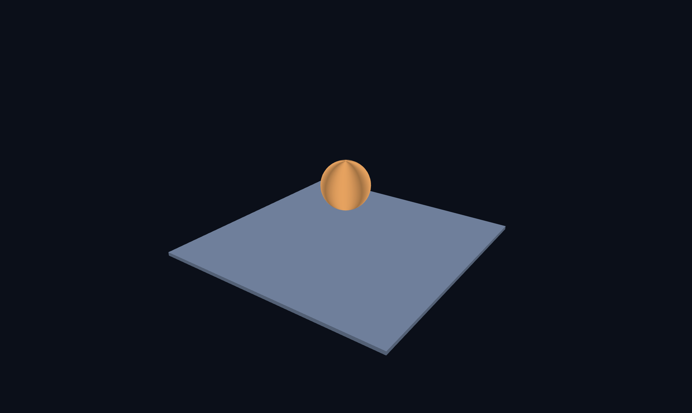
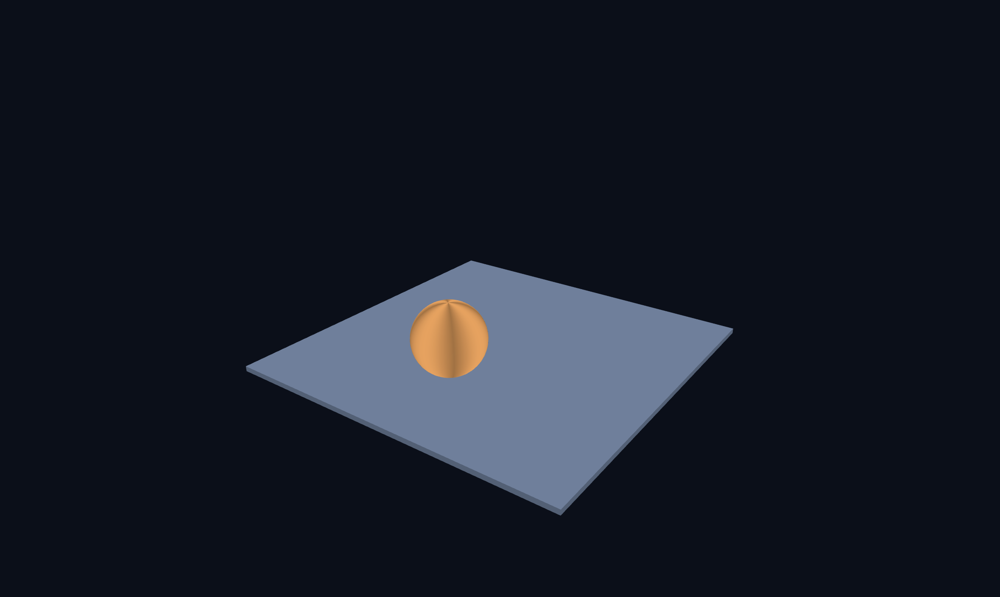
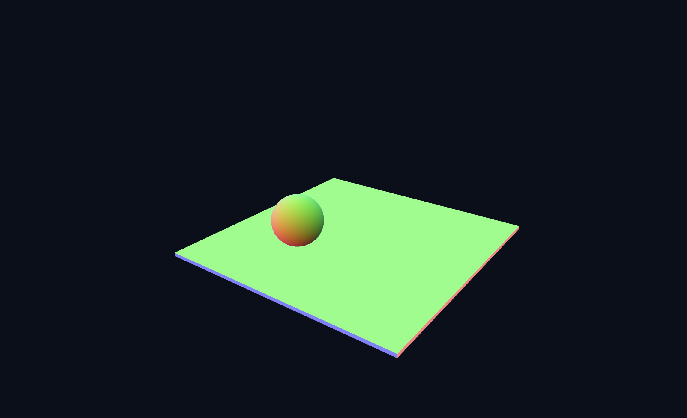
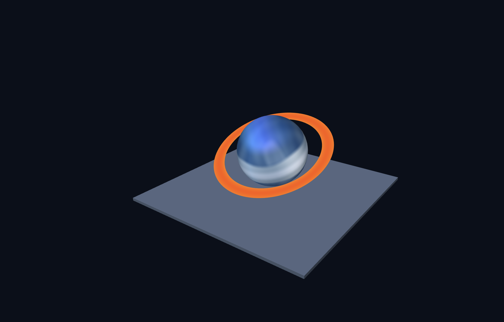

# Week 3 — 그래픽스 파이프라인과 셰이더

## 실행 페이지

- [Task 1 — 떠 있는 공](./task1.html)
- [Task 2 — 얼음 행성](./task2.html)

---

# Task 1 — 떠 있는 공에서 3차원 장면까지

## 1. 자전과 공전 비교

이번 실습에서는 이동 행렬과 회전 행렬의 곱셈 순서를 변경하여
자전과 공전의 차이를 확인하였다.

### 1-1. 자전



자전을 구현할 때는 다음과 같이 이동 행렬과 회전 행렬을 곱하였다.

```javascript
const model = M4.multiply(
  M4.translate(1.9, 1.0, 0),
  M4.rotateY(time * 0.8)
);
```

행렬 변환은 오른쪽부터 적용되므로 먼저 공이 자신의 중심을 기준으로
회전한 뒤 지정된 위치로 이동한다.

따라서 공의 중심 위치는 유지되면서 제자리에서 회전하는
자전 형태의 움직임이 나타났다.

---

### 1-2. 공전



행렬의 순서를 다음과 같이 바꾸었다.

```javascript
const model = M4.multiply(
  M4.rotateY(time * 0.8),
  M4.translate(1.9, 1.0, 0)
);
```

이번에는 공을 원점에서 떨어진 위치로 먼저 이동시킨 뒤
Y축 회전을 적용한다.

따라서 공의 중심 위치 자체가 원점을 중심으로 회전하게 되어
공전하는 움직임이 만들어졌다.

### 자전과 공전 비교

두 경우 모두 같은 이동과 회전을 사용하지만
행렬을 곱하는 순서에 따라 결과가 달라졌다.

이를 통해 3차원 그래픽스에서 변환 행렬의 순서가
물체의 최종 움직임에 중요한 영향을 준다는 것을 확인하였다.

---

## 2. 프래그먼트 셰이더 실험



프래그먼트 셰이더에서는 표면의 법선 벡터를
RGB 색상으로 직접 표현해 보았다.

```glsl
void main() {
  vec3 N = normalize(vNormal);
  fragColor = vec4(N * 0.5 + 0.5, 1.0);
}
```

법선 벡터의 각 성분은 기본적으로 `-1 ~ 1` 범위를 가진다.

하지만 RGB 색상은 `0 ~ 1` 범위를 사용하기 때문에

```glsl
N * 0.5 + 0.5
```

계산을 사용하여 법선 벡터의 범위를 색상으로 사용할 수 있는
`0 ~ 1` 범위로 변환하였다.

구의 경우 표면의 방향이 위치마다 계속 달라지므로
여러 색상이 부드럽게 연결되어 나타났다.

반면 바닥은 각 면이 일정한 방향의 법선을 가지기 때문에
면마다 비교적 일정한 색으로 나타났다.

이를 통해 법선 벡터가 표면이 향하는 방향을 나타내는 값이라는 것을
시각적으로 확인할 수 있었다.

---

# Task 2 — 살아 있는 얼음 행성

## 1. 의도

Task 2에서는 단순한 색상의 구가 아니라
환경과 기상 현상이 존재하는 얼음 행성을 표현하고자 하였다.

행성 대부분은 얼음으로 덮여 있지만
행성 주변에는 뜨거운 가스와 휘발성 물질로 이루어진 고리가 존재한다는
설정을 만들었다.

고리는 붉은색과 황금색으로 빛나며 매우 높은 온도를 가지고 있고,
고리와 가장 가까운 적도 지역은 열의 영향을 받아
얼음이 녹고 많은 수증기가 발생한다.

이 때문에 적도에는 두꺼운 구름과 폭풍, 번개가 발생하도록 표현하였다.

반대로 적도에서 멀어질수록 행성은 다시 차가운 얼음색으로 변하며,
북극과 남극에는 청록색과 보라색 계열의 오로라가 나타나도록 구현하였다.

최종적으로 다음과 같은 특징을 가진 행성을 만드는 것을 목표로 하였다.

- 파란색 계열의 얼음 표면
- 적도 지역의 두꺼운 구름
- 구름 내부의 번개
- 극지방의 오로라
- 행성 주변의 붉은색·황금색 고리
- 얼음 지역에 부분적으로 존재하는 구름

---

# 2. 구현 방법

## 2-1. 얼음 행성 표면

행성 표면이 하나의 파란색으로만 보이지 않도록
여러 개의 `sin()` 값을 조합하여 얼음 표면의 색 변화를 만들었다.

```glsl
float iceNoise =
      sin(N.x * 8.0 + N.z * 5.0) * 0.10
    + sin(N.z * 13.0 - N.x * 7.0) * 0.06
    + sin((N.x + N.z) * 18.0) * 0.03;
```

서로 다른 방향과 주파수를 가진 파동을 합치면
한 방향으로 반복되는 단순한 줄무늬 대신
조금 더 복잡한 표면 변화가 만들어진다.

이 값을 이용하여 진한 얼음색, 파란 얼음색,
밝은 얼음색을 서로 섞었다.

```glsl
vec3 deepIce  = vec3(0.015, 0.10, 0.24);
vec3 blueIce  = vec3(0.06, 0.30, 0.58);
vec3 whiteIce = vec3(0.78, 0.92, 1.00);

float iceVariation = clamp(0.48 + iceNoise, 0.0, 1.0);

vec3 iceColor = mix(deepIce, blueIce, 0.55);
iceColor = mix(iceColor, whiteIce, iceVariation * 0.55);
```

이를 통해 행성 전체가 하나의 파란색으로 보이지 않고
위치에 따라 얼음의 밝기와 색이 조금씩 달라지도록 하였다.

---

## 2-2. 적도 폭풍 구름

적도 지역을 구분하기 위해 법선 벡터의 Y 성분을 이용하였다.

```glsl
float latitude = abs(N.y);
float equatorDist = latitude;
```

구의 적도에서는 `N.y`가 0에 가까워지고
북극과 남극으로 갈수록 절댓값이 1에 가까워진다.

따라서 이 값을 이용하면 적도 주변에만
특정 효과를 적용할 수 있다.

구름의 모양이 완전히 일정한 띠처럼 보이지 않도록
여러 개의 파동을 조합하였다.

```glsl
float cloudShape =
      sin(N.x * 3.7 + N.z * 2.3 + uTime * 0.04) * 0.45
    + sin(N.x * 5.1 - N.z * 3.8 - uTime * 0.025) * 0.30
    + sin((N.x - N.z) * 7.3) * 0.15;
```

각 파동은 서로 다른 방향과 속도를 가지고 있다.

또한 `uTime`을 사용하여 시간이 지나면서
구름의 형태가 천천히 움직이는 것처럼 표현하였다.

구름의 폭도 고정된 값이 아니라 파동의 영향을 받도록 하였다.

```glsl
float cloudWidth =
    0.27 + cloudShape * 0.055;

float cloudBand =
    1.0 - smoothstep(
        cloudWidth,
        cloudWidth + 0.13,
        equatorDist
    );
```

그 결과 적도 전체를 감싸는 완벽한 직선 형태의 띠가 아니라
경계가 불규칙한 구름층을 만들 수 있었다.

---

## 2-3. 구름 색상

구름 역시 하나의 흰색으로 표현하지 않고
회색과 흰색 사이의 색 변화를 적용하였다.

```glsl
float cloudVariation =
    0.5
    + 0.22 * sin(N.x * 4.3 + N.z * 3.1)
    + 0.13 * sin(N.x * 6.7 - N.z * 4.6);

cloudVariation =
    clamp(cloudVariation, 0.0, 1.0);

vec3 cloudDark =
    vec3(0.48, 0.60, 0.70);

vec3 cloudLight =
    vec3(0.93, 0.97, 1.00);

vec3 cloudColor =
    mix(
        cloudDark,
        cloudLight,
        cloudVariation
    );
```

서로 다른 파동을 이용하여 구름 내부의 밝기가
위치마다 조금씩 달라지도록 만들었다.

이를 얼음 표면과 `mix()`하여 적도 주변에
두꺼운 구름층이 존재하는 것처럼 표현하였다.

```glsl
vec3 color =
    mix(
        iceColor,
        cloudColor,
        cloudBand * 0.88
    );
```

---

## 2-4. 적도 지역의 번개

적도의 두꺼운 구름층에서 폭풍이 발생한다는 설정을 표현하기 위해
번개 효과를 추가하였다.

번개는 행성 전체가 아니라
적도 구름 내부에서만 나타나도록 영역을 제한하였다.

```glsl
float lightningZone =
    equator *
    smoothstep(0.35, 0.70, melt);
```

번개가 완전히 직선으로 보이지 않도록
여러 개의 높은 주파수 파동을 조합하였다.

```glsl
float lightningPath =
      sin(N.y * 38.0 + uTime * 0.4) * 0.055
    + sin(N.y * 71.0 - uTime * 0.2) * 0.025
    + sin(N.y * 113.0) * 0.012;
```

서로 다른 주파수의 `sin()` 값을 합치면서
번개가 여러 방향으로 조금씩 꺾여 있는 것처럼 표현하였다.

또한 번개가 항상 켜져 있지 않도록 시간값을 사용하였다.

```glsl
float flashWave =
    sin(uTime * 17.0) *
    sin(uTime * 11.3 + 1.7);

float lightningFlash =
    smoothstep(
        0.72,
        0.96,
        flashWave
    );
```

두 개의 서로 다른 시간 파동이 특정 조건을 만족할 때만
번개가 강하게 나타나도록 하여
짧게 번쩍이는 효과를 만들었다.

---

## 2-5. 극지방 오로라

북극과 남극에는 오로라가 나타나도록 구현하였다.

먼저 위도가 높은 지역만 선택하였다.

```glsl
float auroraBand =
    smoothstep(0.55, 0.82, latitude);
```

적도에서는 값이 거의 0이고
극지방에 가까워질수록 값이 커지기 때문에
오로라가 북극과 남극 주변에만 나타난다.

오로라의 모양은 큰 파장의 두 개의 `sin()` 값을 이용하였다.

```glsl
float flowA =
    sin(N.x * 2.2 + N.z * 2.8 + uTime * 0.35);

float flowB =
    sin(N.x * 1.3 - N.z * 2.0 - uTime * 0.22);

float flow =
    0.5 +
    0.18 * flowA +
    0.12 * flowB;

flow = smoothstep(0.20, 0.78, flow);
```

주파수를 너무 높게 설정하면 오로라가 가느다란 줄처럼 보이기 때문에
비교적 큰 파장을 사용하여 넓게 퍼지는 빛처럼 표현하였다.

오로라의 색은 청록색과 보라색을 사용하였다.

```glsl
vec3 auroraCyan =
    vec3(0.00, 1.00, 0.78);

vec3 auroraPurple =
    vec3(0.48, 0.18, 1.00);

vec3 auroraColor =
    mix(
        auroraCyan,
        auroraPurple,
        colorShift
    );
```

두 색상을 시간에 따라 섞어
오로라의 색도 천천히 변화하도록 만들었다.

---

## 2-6. 얼음 지역의 구름

적도에만 구름이 존재하면 행성이 단순한 띠 형태로 보였기 때문에
지구처럼 얼음 지역에도 부분적인 구름이 나타나도록 추가하였다.

```glsl
float cloudField =
      sin(N.x * 3.2 + N.z * 5.0 + uTime * 0.025) * 0.50
    + sin(N.x * 5.7 - N.z * 2.4 - uTime * 0.018) * 0.30
    + sin(N.x * 2.1 + N.y * 4.0 + N.z * 3.1) * 0.20;
```

여러 방향의 파동을 조합하여
구름이 규칙적인 점이나 줄무늬로 보이지 않도록 하였다.

```glsl
float scatteredCloud =
    smoothstep(0.15, 0.62, cloudField);
```

또한 기존 적도 구름과 겹치는 것을 줄이기 위해
위도를 이용하여 적도에서 멀어진 지역에 주로 나타나도록 하였다.

```glsl
float awayFromEquator =
    smoothstep(0.24, 0.42, latitude);

scatteredCloud *= awayFromEquator;
```

극점 전체가 흰색으로 덮이는 것도 방지하기 위해
극점에 가까워질수록 다시 약해지도록 하였다.

```glsl
float polarFade =
    1.0 - smoothstep(0.82, 0.98, latitude);

scatteredCloud *= polarFade;
```

---

## 2-7. 불타는 행성 고리

행성 주변의 고리는 행성 구체와 별도의 메시로 제작하였다.

```javascript
function makeRing(
  innerRadius = 1.35,
  outerRadius = 2.25,
  segments = 160
) {
```

각 구간마다 안쪽 정점과 바깥쪽 정점을 생성하고
삼각형 두 개를 연결하여 고리의 한 조각을 만들었다.

```javascript
indices.push(
  k,     k + 1, k + 2,
  k + 1, k + 3, k + 2
);
```

고리의 안쪽은 붉은 주황색,
바깥쪽은 황금색으로 설정하였다.

```javascript
colors.push(1.0, 0.12, 0.01);
colors.push(1.0, 0.68, 0.05);
```

고리가 단순한 주황색 원으로 보이지 않도록
프래그먼트 셰이더에서 시간에 따른 색 변화를 추가하였다.

```glsl
float flow1 =
    sin(uTime * 3.0 + vColor.g * 7.0) * 0.5 + 0.5;

float flow2 =
    sin(uTime * 4.7 - vColor.g * 5.0) * 0.5 + 0.5;

float fire =
    flow1 * 0.65 +
    flow2 * 0.35;
```

서로 다른 속도로 움직이는 두 파동을 섞어
고리의 색과 밝기가 시간에 따라 변화하도록 하였다.

이를 통해 뜨거운 물질이 고리 내부에서
계속 움직이는 것과 같은 효과를 표현하고자 하였다.

---

# 3. 구현 중 발생한 문제와 수정

## 3-1. 구름이 점처럼 보이는 문제

처음 얼음 지역에 구름을 추가했을 때
구름이 길게 이어지는 형태가 아니라
표면 위에 작은 흰색 점들이 찍힌 것처럼 보였다.

이를 해결하기 위해 단순한 임계값으로 구름을 자르는 대신
여러 방향의 낮은 주파수 파동을 합성하였다.

또한 `smoothstep()`의 범위를 넓혀
구름의 경계가 부드럽게 이어지도록 수정하였다.

그 결과 점 형태보다는 넓고 불규칙하게 퍼진
구름 형태에 가까워지도록 개선하였다.

---

## 3-2. 구름이 규칙적인 줄무늬처럼 보이는 문제

처음에는 단일 `sin()` 값을 사용했기 때문에
행성 표면에 일정한 간격의 줄무늬가 나타나는 문제가 있었다.

이를 해결하기 위해 서로 다른 방향과 주파수를 가진
여러 개의 `sin()` 값을 합성하였다.

각 파동에 서로 다른 `N.x`, `N.y`, `N.z` 값을 사용하면서
규칙적인 반복이 눈에 잘 보이지 않도록 수정하였다.

---

## 3-3. 셰이더 변수 중복 선언 오류

구름 효과를 수정하는 과정에서 다음과 같은
프래그먼트 셰이더 컴파일 오류가 발생하였다.

```text
'scatteredCloud' : redefinition
'awayFromEquator' : redefinition
'polarFade' : redefinition
'scatteredCloudColor' : redefinition
```

같은 프래그먼트 셰이더 내부에서 동일한 이름의 변수를
두 번 선언했기 때문에 발생한 오류였다.

중복으로 들어간 구름 코드 블록을 제거하고
각 변수가 한 번만 선언되도록 수정하여 해결하였다.

---

# 4. Task 2에서 사용한 주요 셰이더 요소

이번 행성에서는 이미지 텍스처를 사용하기보다는
프래그먼트 셰이더 내부의 계산을 이용하여 여러 효과를 만들었다.

주로 사용한 GLSL 요소는 다음과 같다.

- `sin()` : 얼음, 구름, 번개, 오로라의 불규칙한 변화 생성
- `smoothstep()` : 효과의 경계를 부드럽게 연결
- `mix()` : 두 가지 색상을 자연스럽게 혼합
- `abs()` : 적도와 극지방을 위도로 구분
- `clamp()` : 계산 결과를 필요한 범위로 제한
- `normalize()` : 법선 벡터의 길이를 1로 정규화
- `uTime` : 시간에 따라 구름, 번개, 오로라, 고리가 움직이도록 구현

---

# 5. 최종 결과



최종적으로 얼음으로 덮인 행성을 기본으로 하여
적도에는 두꺼운 폭풍 구름과 번개,
극지방에는 오로라가 나타나는 행성을 구현하였다.

또한 행성 주변에는 붉은색과 황금색으로 빛나는
뜨거운 고리를 별도의 메시로 추가하였다.

이번 실습을 통해 단순히 정점의 위치를 변경하는 것뿐만 아니라
프래그먼트 셰이더에서 각 픽셀의 색을 계산하면
별도의 이미지 텍스처 없이도 다양한 표면 무늬와
시간에 따라 변화하는 효과를 만들 수 있다는 것을 확인하였다.

특히 `sin()`, `smoothstep()`, `mix()`와 `uTime`을 조합하는 방법에 따라
얼음, 구름, 번개, 오로라와 같은 서로 다른 효과를
하나의 셰이더 안에서 구현할 수 있었다.