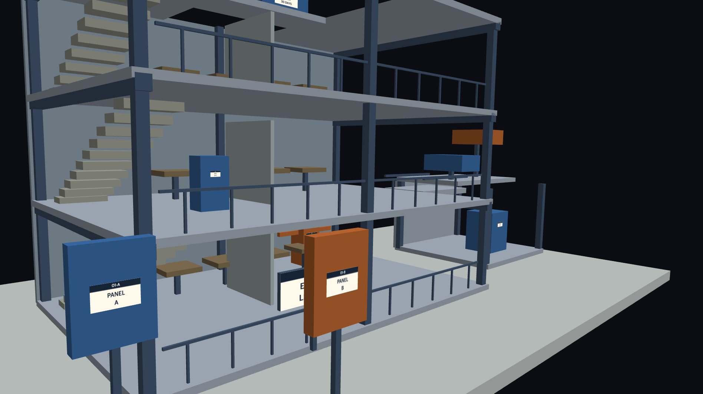
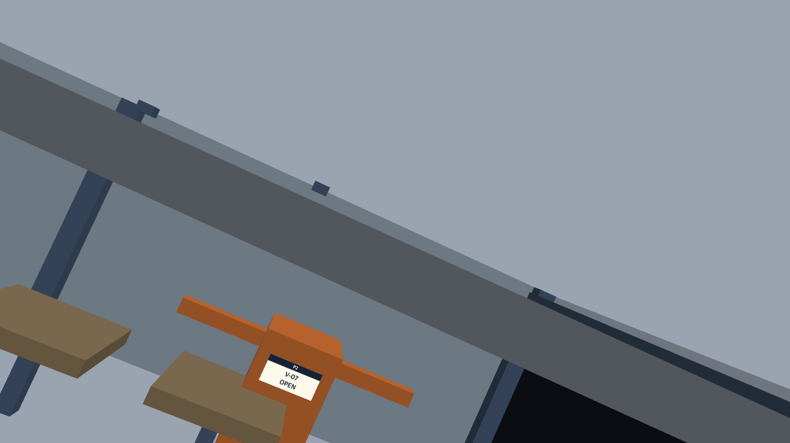
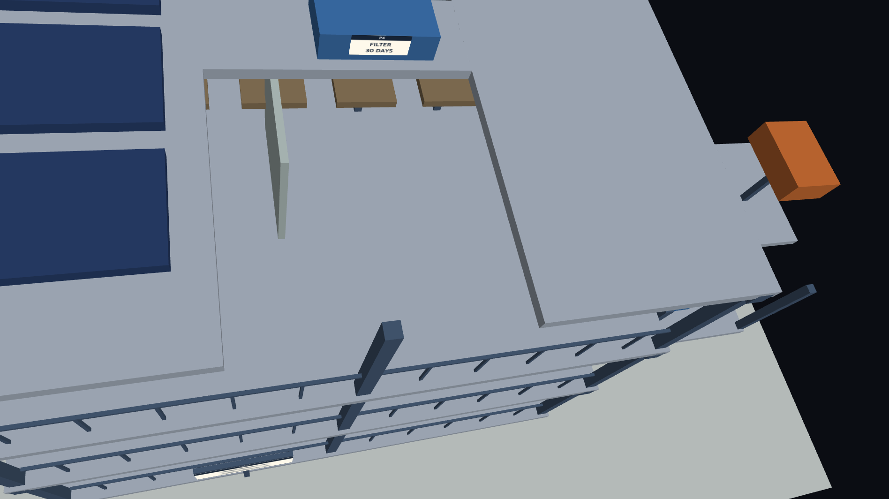
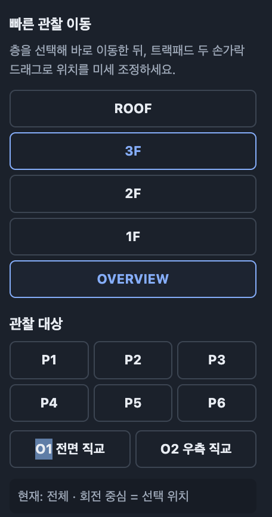
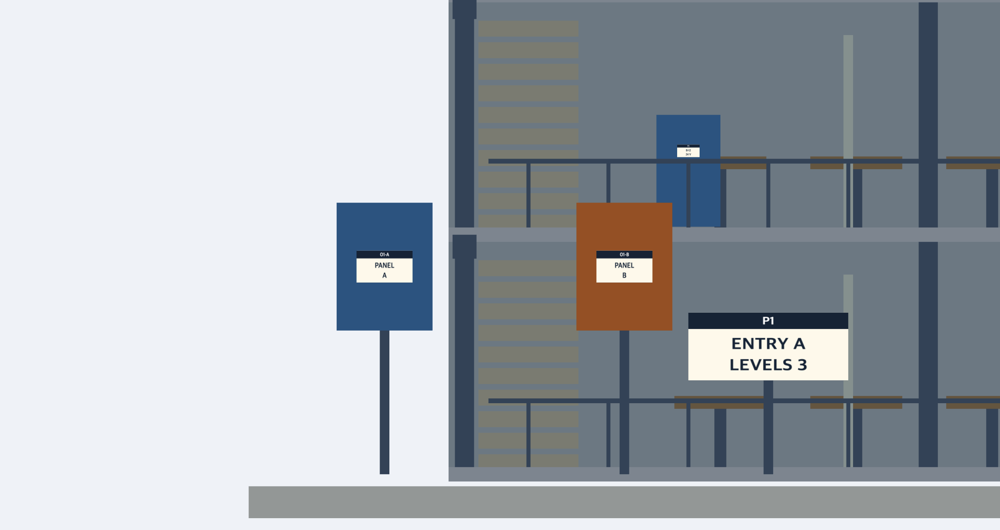
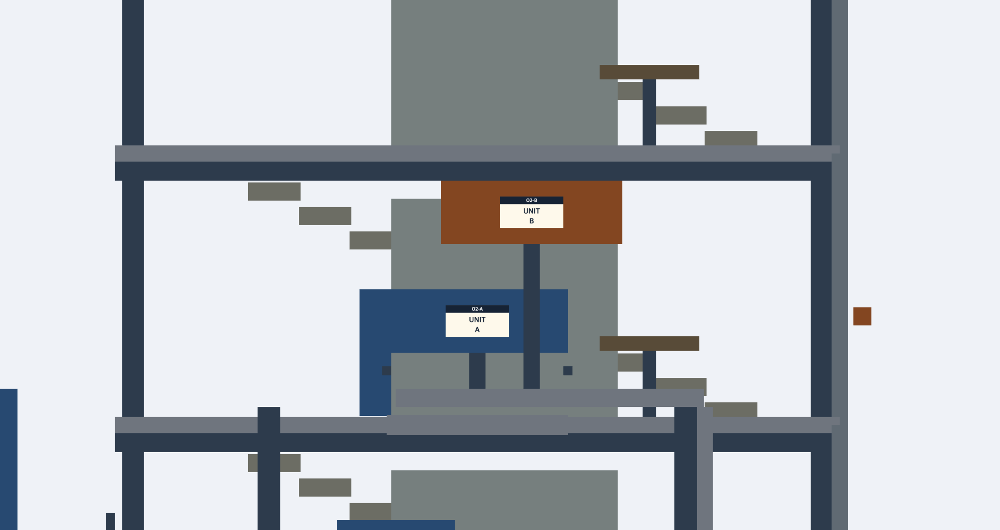
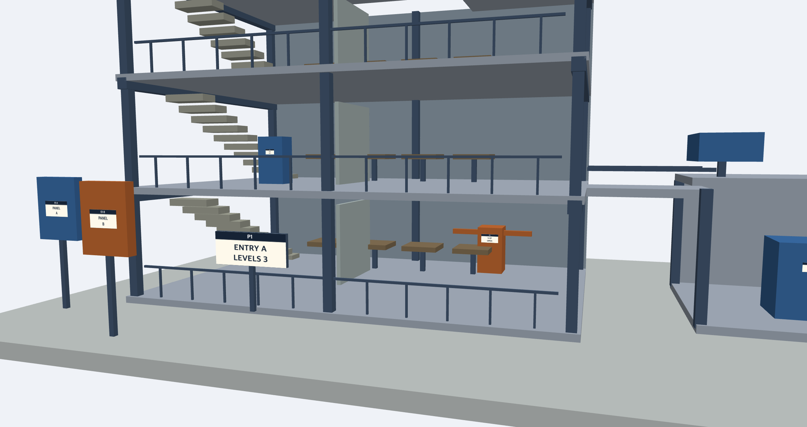
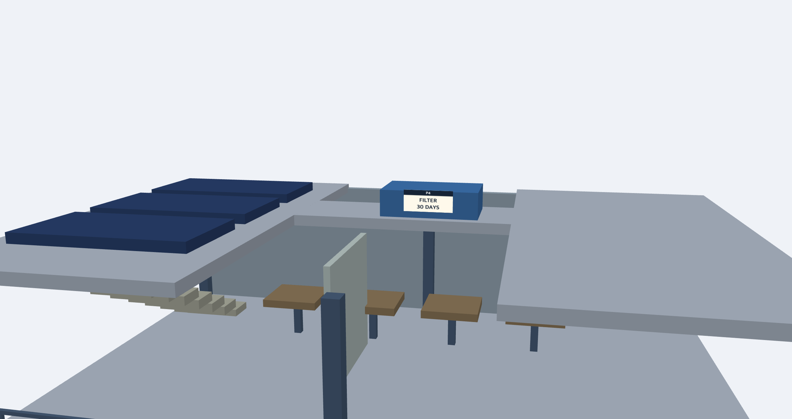

# Week 04 - 중요한 정보를 놓치지 않는 3D 관찰 인터페이스

## 1. 실행 주소 및 조작법

이번 과제에서는 제공된 시작 코드를 그대로 보존한 `baseline`과,
이를 수정하여 관찰 인터페이스를 개선한 `improved` 두 버전을 사용하였다.

### GitHub Pages 실행 주소

- Baseline  
  https://pru1ts.github.io/cg-2026-solar/week4/baseline/

- Improved  
  https://pru1ts.github.io/cg-2026-solar/week4/improved/

※ 최종 제출 전에 `<GitHub-ID>` 부분을 실제 GitHub 아이디로 변경한다.

### Baseline 조작법

- 드래그: 카메라 회전
- Shift + 드래그 / 오른쪽 드래그: 평행 이동
- 휠: 확대·축소
- Home: 전체 보기
- 방향키: 회전
- + / - : 거리 조절

### Improved에서 추가한 조작법

- 트랙패드 두 손가락 이동: 카메라 평행 이동
- 트랙패드 핀치: 확대·축소
- `ROOF / 3F / 2F / 1F`: 선택한 층으로 빠른 이동
- `OVERVIEW`: 전체 보기 복귀
- `P1 ~ P6`: 각 관찰 대상의 읽기 좋은 위치로 이동
- `O1 전면 직교`: O1 비교용 전면 직교 뷰
- `O2 우측 직교`: O2 비교용 오른쪽 측면 직교 뷰

---

# 2. Baseline 관찰 결과

기본 트랙볼만 사용하여 P1 → P6 → O1 → O2를 직접 관찰하였다.

| 지점 | 관찰 결과 |
|---|---|
| P1 | 안내판 이름: **ENTRY A LEVELS 3**, 층수: **3층** |
| P2 | 식별번호: **V-07**, 상태: **OPEN** |
| P3 | 회로 번호: **B-12**, 전압: **24V** |
| P4 | 장치 이름: **FILTER**, 점검 주기: **30 DAYS** |
| P5 | 배관 용도: **RETURN**, 유량: **8 L/min** |
| P6 | 별관 장치 제한 온도: **80°C** |
| O1 | A와 B의 **폭은 다르며 상단 높이는 같다.** |
| O2 | 전면 끝이 더 앞으로 나오는 장치는 **B** |

8개의 관찰 지점은 모두 확인할 수 있었지만, 특정 위치를 찾고
카메라를 적절한 위치로 이동하는 과정에서 반복적인 조작이 필요했다.

---

# 3. Baseline에서 발견한 실제 불편

## 3-1. O1의 A와 B를 같은 조건에서 비교하기 어려움

O1에서 Panel A와 Panel B의 폭과 상단 높이를 비교하려고 하였다.

하지만 기본 트랙볼에서는 카메라를 직접 회전하고 드래그하여
두 물체가 보이는 위치를 찾아야 했다.

자유 시점의 원근 화면에서는 두 물체의 카메라와의 거리와 각도가
달라질 수 있기 때문에 화면에 나타나는 크기만으로 폭과 높이를
정확하게 비교하기 어려웠다.



**그림 1. Baseline에서 Panel A와 Panel B를 비교하는 모습**

---

## 3-2. 1층 내부 P2 관찰 시 주변 구조물에 의해 시야가 제한됨

1층 안쪽 아래에 위치한 P2의 식별 번호를 확인하기 위해
카메라를 낮추고 확대하였다.

P2 자체는 읽을 수 있었지만 카메라를 가까이 이동할수록
위층 바닥과 주변 구조물이 화면의 많은 부분을 차지하였다.

따라서 P2를 보기 좋은 위치로 만들기 위해 카메라의 이동과
회전을 반복적으로 조절해야 했다.



**그림 2. P2 확대 시 상부 구조물에 의해 시야가 제한되는 모습**

---

## 3-3. 옥상의 작은 명판을 확인하기 위해 많은 카메라 이동이 필요함

옥상에 있는 P4의 글자를 확인하기 위해서는 전체 보기에서
카메라를 옥상 방향으로 직접 이동한 뒤 확대해야 했다.

회전과 이동만으로 읽기 좋은 시점을 찾기 어려웠으며,
작은 글자를 확인하기 위해 화면을 가까이에서 보아야 했다.



**그림 3. Baseline에서 옥상 P4를 관찰하는 모습**

---

# 4. 사용자와 관찰 목표

## 사용자

이번 인터페이스의 사용자는 다음과 같이 정하였다.

> **마우스 없이 노트북 트랙패드를 이용하여 3D 시설을 관찰하는 사용자**

마우스와 휠이 없는 환경에서는 트랙패드만으로 회전, 이동,
확대를 모두 수행해야 한다.

따라서 반복적인 회전과 확대에 의존하는 대신,
트랙패드 제스처와 빠른 이동 UI를 함께 사용하는 방법을 설계하였다.

## 관찰 목표

가장 중요한 목표는 다음 두 가지로 정하였다.

1. **빠른 탐색과 명판 가독성**
   - 원하는 층이나 장치까지 반복적인 회전 없이 빠르게 접근한다.
   - P1~P6의 작은 글자를 읽을 수 있는 위치까지 쉽게 이동한다.

2. **구조물의 정확한 시각적 비교**
   - O1과 O2를 원근의 영향을 받지 않는 정해진 축의 직교 화면에서 비교한다.

추가로 세부 관찰 후 전체 구조로 쉽게 복귀할 수 있고,
현재 어떤 위치를 보고 있는지 UI에서 확인할 수 있도록 하였다.

---

# 5. 인터페이스 대안 스케치 및 비교

## 대안 A - 트랙패드 두 손가락 카메라 이동

마우스 없이 트랙패드의 두 손가락 이동을 사용하여
카메라를 상하좌우로 평행 이동시키는 방법을 생각하였다.

### 스케치

```text
┌─────────────────────────┐
│                         │
│       3D 건물 모델       │
│                         │
│          ↑              │
│        ← CAMERA →       │
│          ↓              │
│                         │
└─────────────────────────┘

      ┌───────────┐
      │ 트랙패드   │
      │   ☝  ☝    │
      │    ↕ ↔    │
      └───────────┘

      두 손가락 이동
             ↓
    카메라 상하좌우 이동
```

### 장점

- 별도의 마우스가 없어도 사용할 수 있다.
- 모델을 계속 회전시키지 않고 관찰 위치를 미세 조정할 수 있다.
- 명판을 확대해서 본 상태에서도 화면 위치를 조절하기 쉽다.

### 단점

- 사용자가 원하는 층까지 직접 이동해야 한다.
- 모델이 복잡할 경우 특정 위치를 찾는 문제는 그대로 남는다.

---

## 대안 B - 층별 빠른 이동 UI

화면에 층별 이동 버튼을 제공하고 원하는 층을 클릭하면
카메라가 해당 층으로 자동 이동하는 방법을 생각하였다.

### 스케치

```text
┌──────────────────────────────┐
│                              │
│        3D 건물 모델           │
│                              │
│                              │
│                 ┌──────────┐ │
│                 │  ROOF    │ │
│                 │   3F     │ │
│                 │   2F     │ │
│                 │   1F     │ │
│                 │ OVERVIEW │ │
│                 └──────────┘ │
└──────────────────────────────┘

       1F 클릭
          ↓
   카메라 1층 이동
```

### 장점

- 원하는 층으로 빠르게 이동할 수 있다.
- 층을 찾기 위해 모델을 반복적으로 회전할 필요가 없다.
- OVERVIEW를 통해 전체 구조로 쉽게 돌아갈 수 있다.

### 단점

- 미리 정해진 카메라 위치로 이동한다.
- 자동 이동만으로는 사용자가 원하는 세부적인 위치를 조절하기 어렵다.

---

## 대안 비교 및 최종 선택

대안 A는 세밀한 위치 조정에는 유리하지만 사용자가 원하는 층을
직접 찾아야 하는 문제가 남는다.

반대로 대안 B는 원하는 층에 빠르게 접근할 수 있지만
자동으로 정해진 위치에서 세부 조정이 어렵다.

따라서 두 방법 중 하나만 선택하지 않고 두 방법을 결합하였다.

> **층별 UI로 큰 범위의 이동을 수행한 뒤,
> 트랙패드 두 손가락 이동으로 세부 위치를 조정한다.**

최종 조작 흐름은 다음과 같다.

**관찰 위치 선택 → 자동 카메라 이동 → 두 손가락 미세 조정 → 세부 관찰**

여기에 작은 명판을 더욱 빠르게 찾을 수 있도록 P1~P6 바로가기를 추가하고,
기하학적 비교가 필요한 O1/O2에는 별도의 직교 뷰를 추가하였다.

---

# 6. 최종 Improved UI



**그림 4. 최종 개선 인터페이스**

UI에는 다음 기능을 배치하였다.

- 층별 이동: `ROOF / 3F / 2F / 1F / OVERVIEW`
- 명판 바로가기: `P1 / P2 / P3 / P4 / P5 / P6`
- 비교 뷰: `O1 전면 직교 / O2 우측 직교`
- 현재 관찰 위치 및 상태 표시

층을 선택해 큰 범위의 이동을 수행한 뒤
두 손가락 이동으로 세부 위치를 조정할 수 있다.

---

# 7. 카메라와 입력 방식 구현

## 7-1. 층 및 명판 카메라 Preset

각 층과 명판에 대해 `target`, `distance`, `FOV`,
카메라 방향을 미리 정하였다.

대표적인 실제 구현 코드는 다음과 같다.

```javascript
const presets = {
  overview: {
    label:'전체',
    target:[3,3,0],
    distance:30,
    fov:45,
    yaw:.60,
    pitch:-.44
  },

  floor1: {
    label:'1층',
    target:[1.5,1.45,0],
    distance:18,
    fov:40,
    yaw:.30,
    pitch:-.10
  },

  roof: {
    label:'옥상',
    target:[0,9.25,-.3],
    distance:12,
    fov:36,
    yaw:.20,
    pitch:-.20
  },

  P2: {
    label:'P2',
    target:[3,1.25,-2.085],
    distance:3.0,
    fov:28,
    yaw:0,
    pitch:0
  }
};
```

모든 명판에 같은 카메라 값을 사용하는 것이 아니라
대상의 위치와 크기에 맞게 다른 값을 사용하였다.

---

## 7-2. 선택한 위치로 카메라 이동

버튼을 선택하면 해당 preset의 값을 현재 카메라 상태에 적용한다.

```javascript
function applyPreset(key){
  const p = presets[key];
  if(!p) return;

  controls.state.target = [...p.target];
  controls.state.distance = p.distance;
  controls.state.fov = p.fov;
  controls.state.rotation = rotation(p.yaw, p.pitch);

  mode = key;
  viewer.render = null;
  updateUI();
  viewer.canvas.focus();
}
```

따라서 사용자가 1F나 P2 등을 누르면
카메라가 해당 관찰 목적에 맞는 위치와 방향으로 이동한다.

---

## 7-3. 트랙패드 두 손가락 입력

기본 마우스 휠 확대 기능을 유지하면서,
트랙패드의 두 손가락 스크롤을 카메라 평행 이동으로 사용하도록 수정하였다.

대표 코드는 다음과 같다.

```javascript
canvas.addEventListener('wheel', e => {
  e.preventDefault();

  const looksLikeTrackpad =
    e.deltaMode === 0 &&
    (Math.abs(e.deltaX) > 0 || Math.abs(e.deltaY) < 50);

  if(e.ctrlKey){
    // 트랙패드 pinch
    state.distance = Math.max(
      .12,
      Math.min(100, state.distance * Math.exp(e.deltaY * .002))
    );
  }
  else if(looksLikeTrackpad){
    // 두 손가락 이동 -> 카메라 평행 이동
    const r = canvas.getBoundingClientRect();
    const unit =
      2 * state.distance *
      Math.tan(state.fov * Math.PI / 360) /
      r.height;

    const right = rotate(state.rotation,[1,0,0]);
    const up = rotate(state.rotation,[0,1,0]);

    state.target = state.target.map(
      (v,i) =>
        v +
        e.deltaX * unit * right[i] -
        e.deltaY * unit * up[i]
    );
  }
  else {
    // 일반 마우스 휠은 기존 확대/축소
    state.distance = Math.max(
      .12,
      Math.min(100, state.distance * Math.exp(e.deltaY * .001))
    );
  }

  state.actions++;
}, {passive:false});
```

이를 통해 마우스가 없는 노트북에서도
두 손가락으로 현재 관찰 위치를 자연스럽게 미세 조정할 수 있다.

---

# 8. Eye · Target · FOV · 회전 중심 결정 방법

## Eye

`eye`는 실제 카메라의 월드 위치이다.

일반 관찰에서는 `target`을 기준으로 `distance`와
카메라 회전을 이용하여 eye가 결정된다.

전체 보기에서는 전체 시설이 화면에 들어올 수 있도록 충분한 거리를 두었다.

층별 보기에서는 해당 층과 주변 구조를 함께 파악할 수 있는 거리를 사용하였다.

P1~P6처럼 작은 명판을 볼 때는 명판의 글자를 읽을 수 있도록
distance를 줄여 eye가 대상에 가까워지도록 하였다.

---

## Target

`target`은 현재 카메라가 바라보는 중심이며
동시에 세부 관찰 시 회전의 기준으로 사용하였다.

전체 보기에서는 전체 모델 중심을 사용하고,
1F를 선택하면 1층 중심,
P2를 선택하면 P2 명판 위치를 target으로 사용하였다.

따라서 작은 명판을 관찰한 뒤 카메라를 조정하더라도
관심 대상이 화면에서 쉽게 사라지지 않도록 하였다.

---

## FOV

전체 구조와 작은 명판은 필요한 시야 범위가 다르기 때문에
같은 FOV를 사용하지 않았다.

대표적으로 다음과 같이 설정하였다.

- 전체 보기: **45°**
- 층별 보기: 약 **36~40°**
- 작은 명판: 약 **28~32°**

전체 보기에서는 넓은 영역을 보여 주고,
작은 명판에서는 FOV를 좁혀 대상이 화면에서 더 크게 보이도록 하였다.

단순히 FOV만 줄이는 것이 아니라 대상의 크기와
카메라 거리도 함께 조정하였다.

---

## 회전 중심

Baseline에서는 전체 모델을 중심으로 회전하다 보면
확대해서 보고 있던 작은 명판이 화면 밖으로 벗어날 수 있었다.

Improved에서는 현재 선택한 위치를 `target`으로 설정하였다.

따라서 1층을 선택하면 1층이,
P2를 선택하면 P2가 관찰과 회전의 중심이 된다.

---

# 9. 원근 투영과 직교 투영

P1~P6은 작은 명판의 글자를 읽는 것뿐만 아니라
그 명판이 어떤 장치와 위치에 붙어 있는지도 함께 파악해야 한다.

따라서 일반 층/명판 관찰에서는 공간의 앞뒤 관계를 이해하기 쉬운
**원근 투영(Perspective)**을 유지하였다.

반면 O1과 O2는 구조물의 실제 상대적 크기와 돌출 정도를
같은 축에서 비교하는 것이 목적이므로 **직교 투영(Orthographic)**을 사용하였다.

---

# 10. O1 전면 직교 구현

O1에서는 건물 앞쪽에서 두 패널을 바라보는
전면 직교 화면을 제공하였다.



**그림 5. O1 전면 직교 뷰**

O1에서 A와 B의 위쪽 모서리를 같은 화면에서 비교하면
상단 높이는 같고 폭은 서로 다르다는 것을 확인할 수 있다.

직교 화면이므로 카메라와의 깊이 차이에 따라
한쪽 패널이 더 작게 보이는 원근 효과를 제거할 수 있다.

---

# 11. O2 오른쪽 측면 직교 구현

O2에서는 건물 오른쪽에서 왼쪽 방향을 바라보는
오른쪽 측면 직교 화면을 제공하였다.



**그림 6. O2 오른쪽 측면 직교 뷰**

같은 측면 축과 배율에서 UNIT A와 UNIT B의 전면 끝을 비교하면
**B가 더 앞으로 돌출되어 있음**을 확인할 수 있다.

O1/O2의 실제 구현에서는 모델에 정의된 비교 위치와
`viewDirection`을 이용하였다.

```javascript
function orthographic(id){
  const c = viewer.model.comparisons.find(x => x.id === id);
  if(!c) return;

  const dir = c.viewDirection;
  const distance = 18;

  const eye = c.position.map(
    (v,i) => v - dir[i] * distance
  );

  const halfHeight = id === 'O1' ? 3.4 : 3.0;

  viewer.render = v => v.drawView({
    eye,
    target:[...c.position],
    up:[0,1,0],
    orthographic:true,
    halfHeight,
    near:.02,
    far:180
  });

  controls.state.target = [...c.position];
}
```

두 비교 화면은 대상마다 임의로 확대해서 픽셀 크기를 비교하는 방식이 아니라,
정해진 축의 직교 투영을 사용하여 비교하도록 하였다.

---

# 12. 1층과 옥상 개선 사례

## 1층



**그림 7. 1F 버튼으로 1층 관찰 위치에 이동한 모습**

Baseline에서는 1층 내부를 찾기 위해 직접 회전하고 이동해야 했지만,
Improved에서는 먼저 1F로 이동한 뒤 두 손가락으로
필요한 위치만 미세 조정할 수 있다.

## 옥상



**그림 8. ROOF 버튼으로 옥상 P4를 관찰한 모습**

P4의 `FILTER / 30 DAYS` 정보를 빠르게 확인할 수 있으며,
필요한 경우 두 손가락 이동으로 위치를 추가 조정할 수 있다.

---

# 13. 같은 8건에 대한 Baseline / Improved 비교

같은 P1~P6, O1, O2 총 8건을 두 버전에서 다시 관찰하였다.

| 지점 | Baseline | Improved | 결과 |
|---|---|---|---|
| P1 | 직접 이동하여 ENTRY A / LEVELS 3 확인 | P1 바로가기로 이동 | 탐색 과정 감소 |
| P2 | 내부로 확대할 때 상부 구조물이 시야를 차지함 | 1F/P2 이동 후 두 손가락 미세 조정 | 위치 접근과 조정이 쉬워짐 |
| P3 | 2층에서 작은 B-12 / 24V 명판을 직접 탐색 | P3 바로가기 사용 | 반복 탐색 감소 |
| P4 | 옥상으로 직접 이동·확대해야 함 | ROOF/P4 바로가기 사용 | 옥상 접근 및 가독성 개선 |
| P5 | 초기 화면에서 보이지 않는 뒤쪽을 직접 찾아야 함 | P5 바로가기 사용 | 뒤쪽 위치 탐색 감소 |
| P6 | 본관에서 떨어진 별관으로 직접 이동해야 함 | P6 바로가기 사용 | 별관 접근 과정 감소 |
| O1 | 자유 원근 시점에서 A/B 비교 | 전면 직교 뷰에서 같은 축으로 비교 | 폭·높이 비교가 명확해짐 |
| O2 | 측면 방향을 직접 맞춰 A/B 돌출 비교 | 오른쪽 측면 직교 뷰 제공 | B의 돌출 관계를 비교하기 쉬워짐 |

두 버전 모두 8개의 관찰 자체는 완료할 수 있었다.

따라서 이번 개선의 핵심은 정답의 수를 늘리는 것이 아니라
**같은 관찰을 수행할 때 필요한 탐색·회전·확대·되돌아가기의 부담을 줄이는 것**이었다.

---


# 14. 전체 관찰 시간 및 조작 횟수 비교

P1~P6, O1, O2의 총 8개 관찰 과제를 Baseline과 Improved에서
각각 수행한 뒤 전체 관찰 시간과 조작 횟수를 비교하였다.

| 항목 | Baseline | Improved | 변화 |
|---|---:|---:|---:|
| 전체 관찰 시간 | 약 1300초 | 약 800초 | 약 500초 감소 |
| 조작 횟수 | 1611회 | 1382회 | 229회 감소 |

전체 관찰 시간은 약 **1300초에서 800초로 감소하여 약 38.5% 줄어들었고**,
조작 횟수는 **1611회에서 1382회로 감소하여 약 14.2% 줄어들었다.**

Baseline에서는 원하는 관찰 위치를 찾기 위해 회전, 확대·축소,
평행 이동을 반복해야 했다.

반면 Improved에서는 층별 이동 버튼과 P1~P6 바로가기를 이용하여
관찰 대상 근처로 먼저 이동할 수 있었고, 이후 트랙패드 두 손가락
이동을 이용하여 필요한 위치만 미세 조정할 수 있었다.

또한 O1과 O2에서는 사용자가 직접 카메라 방향을 맞추는 대신
전면 직교와 오른쪽 측면 직교 버튼을 이용하여 비교 시점으로
바로 이동할 수 있었다.

따라서 Improved에서는 단순히 명판을 더 크게 보여 주는 것뿐만 아니라,
관찰 위치를 찾기 위해 필요한 반복적인 카메라 조작 자체가 감소하였다.
=

---

# 15. 개선 전후 조작 과정

Baseline에서는 특정 명판을 보기 위해 대체로 다음 과정을 반복하였다.

> **전체 보기 → 회전 → 이동 → 확대 → 위치 재조정 → 다시 회전 → 관찰**

Improved에서는 다음과 같이 단순화하였다.

> **층 또는 관찰 대상 선택 → 자동 이동 → 두 손가락 미세 조정 → 관찰**

O1/O2는 다음과 같이 변경하였다.

> **직접 축 맞추기 → 비교**

에서

> **전면/우측 직교 버튼 → 같은 축에서 비교**

로 변경하였다.

---

# 16. 측정의 한계

이번 비교에는 몇 가지 한계가 있다.

첫째, 이번 구현은 실제 길이를 숫자로 계산하는 정밀 측정 도구가 아니다.

O1과 O2는 직교 투영을 이용하여 같은 축과 배율에서
시각적으로 비교하기 쉽게 만든 것이며,
패널 폭이나 돌출 길이를 실제 월드 단위의 숫자로 출력하지 않는다.

둘째, Baseline을 먼저 사용한 뒤 Improved를 테스트했기 때문에
두 번째 관찰에서는 이미 P1~P6의 위치를 알고 있었다.

따라서 Improved에서 탐색 시간이 줄어든 결과에는
인터페이스 개선뿐 아니라 위치를 학습한 효과도 일부 포함될 수 있다.

셋째, 트랙패드의 스크롤 이벤트 크기는 기기와 설정에 따라 달라질 수 있다.

따라서 단순히 이벤트 횟수만 비교하기보다
실제로 필요한 회전, 확대, 되돌아가기 과정이 줄었는지를 중심으로 평가하였다.

---

# 17. 추가 수정 전후 기록

## 처음 생각한 방법

처음에는 **트랙패드 두 손가락 카메라 이동**만 추가하려고 하였다.

이 방법을 사용하면 작은 명판을 확대했을 때
카메라 위치를 미세하게 조절하기 쉬워진다는 장점이 있었다.

그러나 두 손가락 이동만으로는 1층, 3층, 옥상,
별관과 같은 큰 범위의 위치를 사용자가 직접 찾아야 하는 문제가 남았다.

## 추가 수정

이 문제를 해결하기 위해 다음 기능을 추가하였다.

- `ROOF / 3F / 2F / 1F / OVERVIEW` 층별 빠른 이동
- `P1 ~ P6` 관찰 대상 바로가기
- `O1 전면 직교`
- `O2 우측 직교`
- 현재 관찰 위치 상태 표시

최종적으로

> **빠른 위치 접근 + 두 손가락 세부 조정**

으로 역할을 분리하였다.

큰 범위 이동은 버튼이 담당하고,
정확한 최종 위치는 사용자가 트랙패드로 조정하도록 하였다.

---

# 18. AI 제안과 본인의 판단

코드 수정에는 AI의 도움을 사용하였다.

AI에게는 `baseline`을 수정하지 않고 `improved`의 기존 파일 구조를
먼저 확인한 뒤, 제공 모델을 유지하면서 카메라와 UI만
확장하도록 요청하였다.

## 검토한 대안

처음 검토한 핵심 대안은 다음 두 가지였다.

1. 두 손가락 카메라 이동만 구현
2. 층별 버튼으로 카메라를 자동 이동

두 손가락 이동만 사용하면 자유도는 높지만
원하는 위치를 찾는 문제를 해결하지 못한다.

반대로 자동 이동만 사용하면 접근은 빠르지만
사용자가 원하는 정확한 시점을 만들기 어렵다.

따라서 어느 한쪽을 그대로 선택하지 않고
두 방식을 결합하기로 판단하였다.

## AI 제안을 수정·검증한 부분

AI가 카메라 preset과 O1/O2 직교 뷰를 구현한 뒤,
실제 프로그램을 직접 실행하여 다음을 확인하였다.

- 트랙패드 두 손가락 이동이 실제 MacBook 트랙패드에서 동작하는지 확인
- 1F/2F/3F/ROOF 버튼이 해당 위치로 이동하는지 확인
- P1~P6 명판이 읽을 수 있는 위치에서 표시되는지 확인
- O1이 전면 직교 시점인지 확인
- O2가 오른쪽 측면 직교 시점인지 확인
- OVERVIEW를 이용하여 전체 보기로 복귀할 수 있는지 확인

즉 AI가 제안한 코드를 그대로 결과로 간주하지 않고,
실제 관찰 결과를 확인하여 최종 인터페이스로 채택하였다.

특히 O1/O2는 단순히 대상을 크게 보여 주는 것이 아니라
**같은 축의 직교 화면에서 비교해야 한다**고 판단하여
일반 명판 이동 기능과 별도의 비교 모드로 구성하였다.

---

# 19. 모델 보존

이번 과제에서는 제공된 모델의 위치, 크기, 명판 내용을 변경하지 않았다.

`week4/baseline`은 비교용 원본으로 유지하고,
`week4/improved`에서 카메라 조작과 UI 기능만 수정·확장하였다.

따라서 개선 결과는 모델 자체를 바꾸어 정보를 쉽게 만든 것이 아니라
**같은 모델을 더 쉽게 관찰할 수 있도록 카메라 인터페이스를 변경한 결과**이다.

---

# 20. 결론

이번 과제에서는 기본 트랙볼을 직접 사용하면서 다음 세 가지 주요 문제를 발견하였다.

1. O1의 A/B를 원근 자유 시점에서 동일한 조건으로 비교하기 어렵다.
2. 내부 명판을 확대하면 주변 구조물 때문에 시야 조정이 필요하다.
3. 옥상이나 멀리 떨어진 작은 명판까지 직접 이동하는 과정이 번거롭다.

이를 개선하기 위해 마우스 없이 트랙패드를 사용하는 사용자를 대상으로
두 가지 인터페이스 대안을 설계하였다.

최종적으로

**층별·대상별 빠른 이동 + 트랙패드 두 손가락 카메라 이동**

을 결합하였다.

또한 P1~P6에서는 원근 투영을 이용하여 장치와 주변 위치를 함께 관찰하고,
O1/O2에서는 비교 목적에 맞게 전면/오른쪽 측면 직교 투영을 사용하였다.

카메라의 `eye`, `target`, `FOV`, 회전 중심 역시
모든 대상에 같은 값을 적용하지 않고 관찰 목적과 대상 크기에 따라 결정하였다.

그 결과 사용자가 직접 수행해야 했던 반복적인 회전과 이동을 줄이고,
원하는 위치까지 빠르게 접근한 뒤 트랙패드로 세부 위치를 조정할 수 있었다.

이번 구현을 통해 3D 관찰 인터페이스에서는 단순히
카메라를 자유롭게 움직일 수 있게 하는 것보다,

> **사용자가 무엇을 관찰하려는지에 맞추어 적절한 시점과 투영을 제공하는 것**

이 중요하다는 것을 확인하였다.